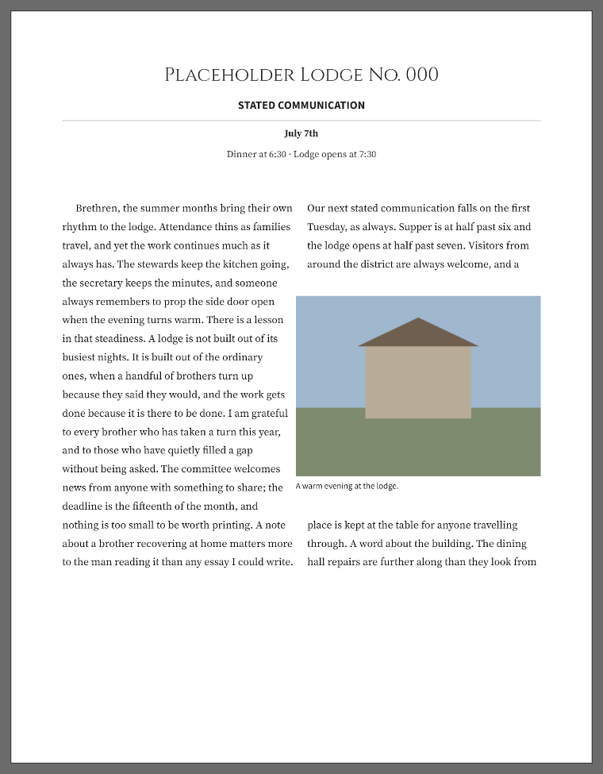
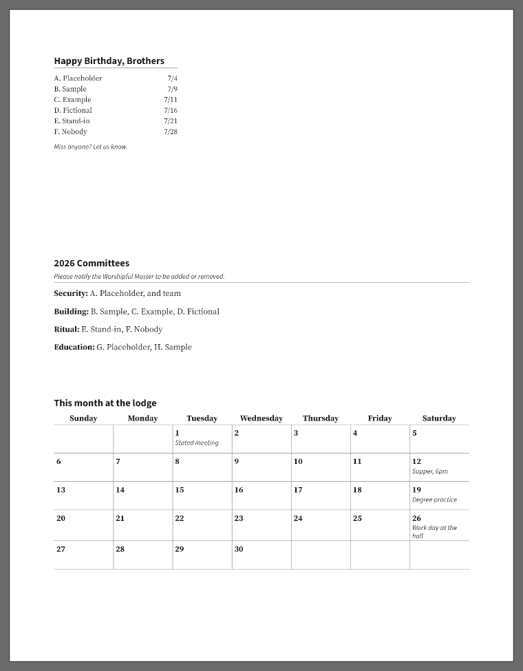

# TrestleBoard

A desktop editor for producing a Masonic lodge's monthly trestle board newsletter — lay out text,
tables and photographs on a page, fill the recurring sections with step-by-step wizards, and export
the PDF you email round.

Built for Indian Land Lodge 414's trestle board committee, with accessibility for elderly users as a
first-class requirement rather than a settings page at the end.

**→ [donaldsteele.github.io/TrestleBoard](https://donaldsteele.github.io/TrestleBoard/)** — what it
does, how to install it, help pages for the committee, and a reference for every command.


## Installing

Downloads for Windows, macOS and Linux are on the
[releases page](https://github.com/donaldsteele/TrestleBoard/releases). The
**[install page](https://donaldsteele.github.io/TrestleBoard/install/)** walks through it in plain
language, including the SmartScreen and Gatekeeper warnings that appear because the app is not
code-signed. Installed copies update themselves from that same releases page.

## What makes it different from a word processor

A trestle board is a *page*, not a document. Blocks go anywhere and the body text flows around them,
so a photograph dropped into an article pushes the words aside and they close up behind it. The app
draws its own pages on a SkiaSharp/HarfBuzzSharp layout engine, and **the same renderer draws the
editor and the PDF** — what you arrange is what prints, on every machine that opens it.

The officers table, the birthday list, the committees and the district calendar are not typed as
tables. A wizard asks one question per screen in large type, reads back what it is about to write,
and lays it out for you — and the lodge's address book fills most of it in.

An article can run down two columns, break around a photograph, carry a border or a shade to mark it
out as a notice, and take a rule right across the page — none of which needs a ruler, a grid or a
number typed into a box.



There is a [tour with a picture of each part](https://donaldsteele.github.io/TrestleBoard/tour/).

## What the reader gets

Every page can carry a line along the bottom saying which lodge, which issue and which page it is —
one wording, filled in from what the app already knows.

In the exported PDF, **email addresses, web addresses and telephone numbers are tappable**. Half a
lodge reads its newsletter on a telephone, and there is nothing to learn: the committee writes the
address as they always did and the reader's device does the rest. Nothing is underlined and nothing
turns blue, because the same file is still printed and handed out.

A page can also be saved as a picture for the lodge's own page or a text message, and the month can
go on the page as a grid with the stated meeting already marked.



## Built for the people who use it

Choose something on the page and what you can do to it appears beside it, each with a sentence
saying what it is for. **Nothing in that panel is ever greyed out**: an action that does not apply is
not shown, and one that is blocked says why in plain words.


Every command has a keyboard path and a menu entry, dragging is always an accelerator and never the
only way, chrome text is 16 point at minimum, hit targets are at least 44 pixels, an icon never
appears without its label, and colour is never the only signal. There is a true high-contrast theme
and the whole interface scales to 200% without the page changing, because the page is paper and has
its own zoom. Each of those is a test that fails the build.

The [accessibility page](https://donaldsteele.github.io/TrestleBoard/accessibility/) states all of it
with the screenshots.

## Architecture, in one screen

- **Platforms:** Windows, Linux, macOS (.NET 10 + Avalonia). `TrestleBoard.App` is the only project
  that references Avalonia.
- **Rendering:** one SkiaSharp/HarfBuzzSharp layout engine shared by the canvas and PDF export.
- **File format:** `.tboard` — a zip container holding the document and the untouched original of
  every photograph in it.
- **Fonts:** bundled only, never the ones installed on your computer. Static instances, each recorded
  in a manifest with its SHA-256, which is what lets a newsletter paginate identically on all three
  operating systems and in CI.
- **Commands:** every action is declared once in `ActionCatalog`, which answers "can I, and if not,
  why not, in plain English". The menu bar, the action panel, the keyboard table, the in-app help and
  the website's command reference are all views of that one declaration.

`PLAN.md` is the full architecture and milestone plan; `docs/M*-spec.md` is one document per
milestone explaining what was built and what was deliberately left out.

## Building

Requires the .NET 10 SDK (pinned in `global.json`).

```
dotnet build TrestleBoard.slnx
dotnet test TrestleBoard.slnx
dotnet run --project src/TrestleBoard.App
```

Two tools sit beside it. `tools/TrestleBoard.Screenshots` generates every image under `docs/images/`
against fictional fixtures — the screenshots in this file were not taken by hand.
`tools/TrestleBoard.Site` builds the website into `site/_site`, generating the command reference from
`ActionCatalog` and drawing the emblems from `EmblemLibrary`, so neither can describe a version of
the program that no longer exists.

## Licence

TrestleBoard is free for non-profit use, under the [PolyForm Noncommercial License
1.0.0](LICENSE). A lodge, a church, a charity, a school, a public body or a person at home may use
it, copy it, change it and pass it on, at no cost and without asking. Making money with it — selling
it, selling a service built on it, or using it in the running of a for-profit business — needs a
separate licence; ask for one by opening an issue.

The licence is compiled into the application so that it travels with every installed copy, and is
reachable from **Help → Licence**.

The twenty bundled typefaces are somebody else's work and a separate matter: they are used under the
SIL Open Font License 1.1, with designers, upstream sources and pinned versions listed in
[docs/FONTS.md](docs/FONTS.md). Their full licence text ships inside the installer and is reachable
from **Help → Fonts and licences** — the OFL requires that of anything redistributing the fonts.

Nothing here grants any right in the names, arms or symbols of Indian Land Masonic Lodge 414 or of
any Grand Lodge.
