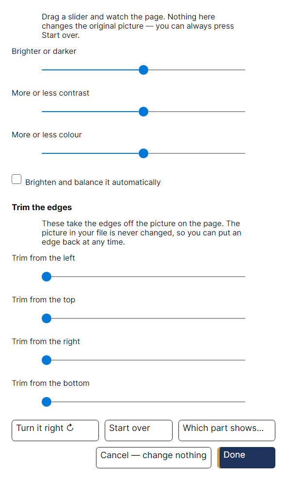

# TrestleBoard

A purpose-built desktop editor for producing a Masonic lodge's monthly trestle board
newsletter — edit text, tables, and photos on a free-form page canvas, fill recurring
sections (officers, birthdays, committees, district calendar) with simple step-by-step
wizards, and export a distribution-ready PDF.

Built for Indian Land Lodge 414's trestle board committee, with accessibility for
elderly users as a first-class requirement.


## What it does

### Lay out the page

Blocks go anywhere on the page and body text flows around them. This is the whole reason
the app draws its own pages instead of using a word processor's: a photograph dropped into
the middle of an article pushes the words aside and they close up again behind it.


### Write and format text

Click into any frame and type. Everything can be undone, including things that are usually
one-way — moving a photo, changing a whole list, changing the typeface of the newsletter.

Choosing a typeface is a picture of the typeface, not a list of names, and every sample is
drawn by the same engine that will draw the PDF. Twenty families ship with the app and no
font installed on your computer is ever used, which is what makes a page look the same on
every machine.


### Fill in the recurring lists

The officers table, the birthday list, the committees and the district calendar are not
typed as tables. They are filled in by a wizard that asks one question per screen in large
type, and lays the answers out for you.


Every wizard ends by reading back what it is about to write, so nothing lands on the page
unseen.


Once a list exists, the wizard is not the only way back in — the same information is
editable all at once, in rows big enough to read.


### Photographs

Photographs are never altered. The original file goes into the newsletter untouched and
every change — crop, straighten, brighten — is a recipe applied when the page is drawn, so
the same picture can be re-cropped from the original months later. There is one **Fix
photo** button for the common case, and three large sliders behind it for the rest.



### Your address book

A brother's name is typed once. The lodge's member list is imported from the spreadsheet
the committee already keeps, and from then on the birthday list fills itself in and the
officers wizard offers names rather than asking for them.


Importing asks one question per piece of lodge information — *"Name: which column has
it?"* — instead of showing a grid of column headings and hoping. The answers are guessed
first, and nothing is written until the last screen.


### Export the PDF

One command produces the file you email to the lodge. It is drawn by the same code that
draws the screen, with real embedded fonts and selectable text.


## Built for the people who use it

The committee is mostly elderly, and that shaped the whole application rather than a
settings page at the end of it.

Choose something on the page and what you can do to it appears beside it, each with a
sentence saying what it is for. Nothing in that panel is ever greyed out: an action that
does not apply is simply not shown, and one that is blocked says why in plain words.


Every command has a keyboard path and a menu entry — dragging is always an accelerator,
never the only way. Text is 16 point at minimum and 18 to 20 in the wizards, hit targets
are at least 44 pixels, and every control has a name a screen reader can read.

There is a true high-contrast theme, and the whole interface scales to twice its size
without the page itself changing, because the page is a piece of paper and has its own
zoom.


Both are two choices in one small window, and nothing else is in it.


Work is saved automatically every minute. If the machine is switched off mid-sentence, the
next launch offers the work back with a picture of the page so it is obvious what is being
restored.


## Each month


The usual month begins with **Start from last month**. The officers, committees and
district table carry across, the dates move on, and last month's articles are cleared so
this month's can be written.

What the issue still needs is then listed with nothing selected, one line each and a
sentence saying why — the birthday list still showing last month, an article still holding
its reminder text, a PDF not yet exported.


To see a finished newsletter without making one, open **Help → Show me an example
newsletter**.

## Installing

Downloads for Windows, macOS and Linux are on the
[releases page](https://github.com/donaldsteele/TrestleBoard/releases).
**[docs/INSTALL.md](docs/INSTALL.md)** walks through it in plain language, including the
SmartScreen and Gatekeeper warnings that appear because the app is not code-signed. Installed
copies update themselves from that same releases page.

## How it works

- **Platforms:** Windows, Linux, macOS (.NET 10 + Avalonia)
- **Rendering:** custom SkiaSharp/HarfBuzzSharp layout engine shared by the on-screen
  editor and PDF export — what you see is exactly what prints
- **File format:** `.tboard` (zip container; originals of every photo kept losslessly)
- **Fonts:** bundled only, never the ones installed on your computer. Every face is a
  static instance, subsetted and recorded in a manifest with its SHA-256, which is what
  lets the same newsletter paginate identically on all three operating systems and in CI.


## Building

Requires the .NET 10 SDK (see `global.json`).

```
dotnet build TrestleBoard.slnx
dotnet test TrestleBoard.slnx
dotnet run --project src/TrestleBoard.App
```

The screenshots in this file are generated, not taken by hand — see
[docs/images/README.md](docs/images/README.md).

See `PLAN.md` for the full architecture and milestone plan.

## Licence

All twenty bundled typefaces are used under the SIL Open Font License 1.1, with the
designers, upstream sources and pinned versions listed in [docs/FONTS.md](docs/FONTS.md).
The complete licence text ships inside the installer and is reachable from **Help → Fonts
and licences** — the OFL requires that of anything redistributing the fonts, and shipping
the fonts without it would not be enough.

The application's own source has no licence file yet. Until one is added, no permission to
copy, modify or redistribute the code is granted; the repository is published so the lodge
and its committee can build and audit what they run.
