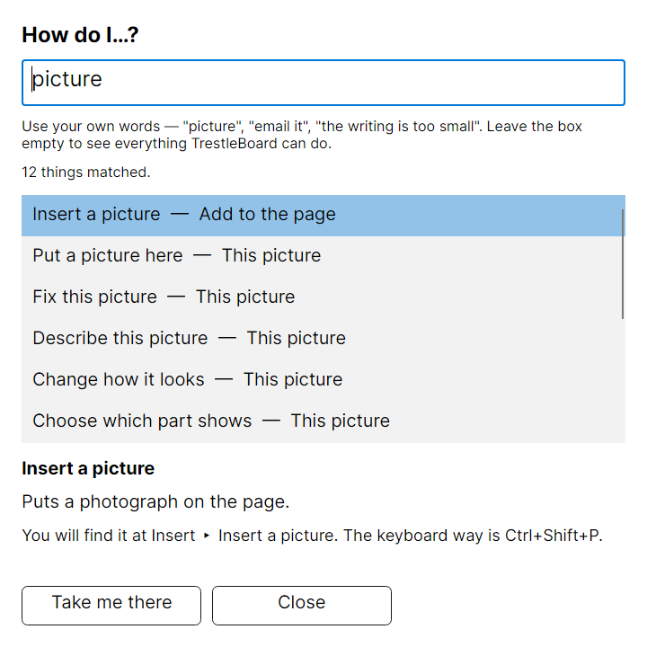
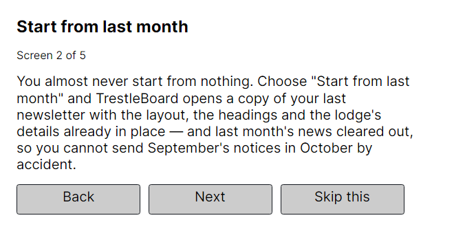
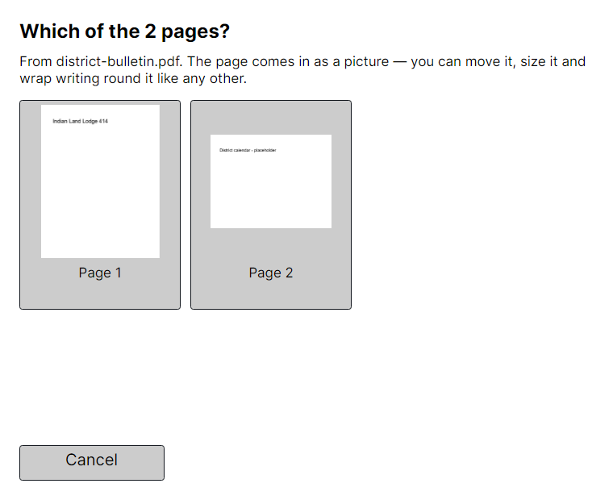
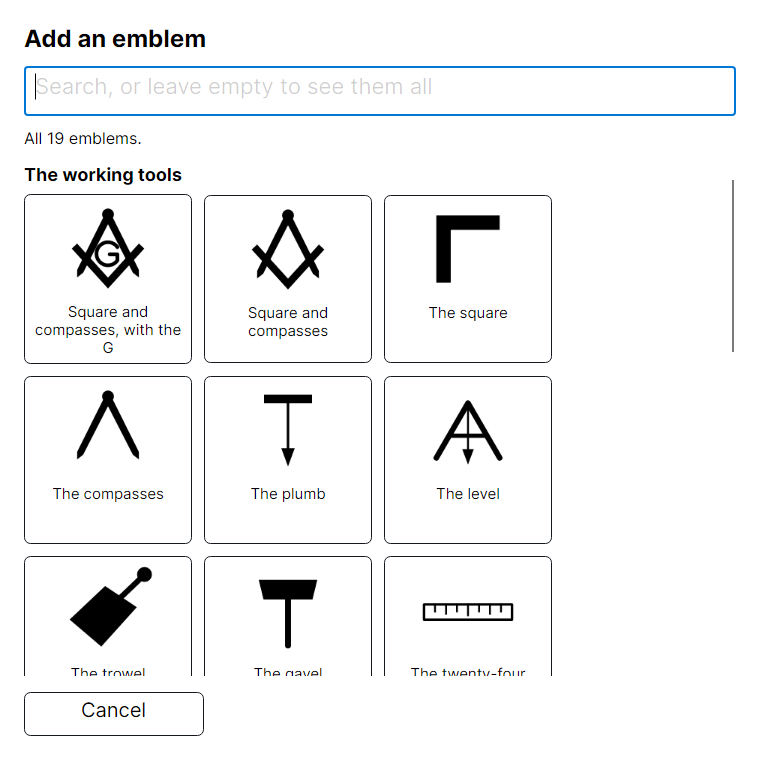
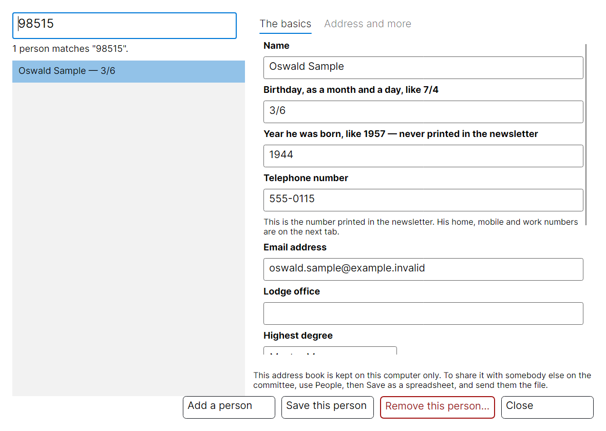
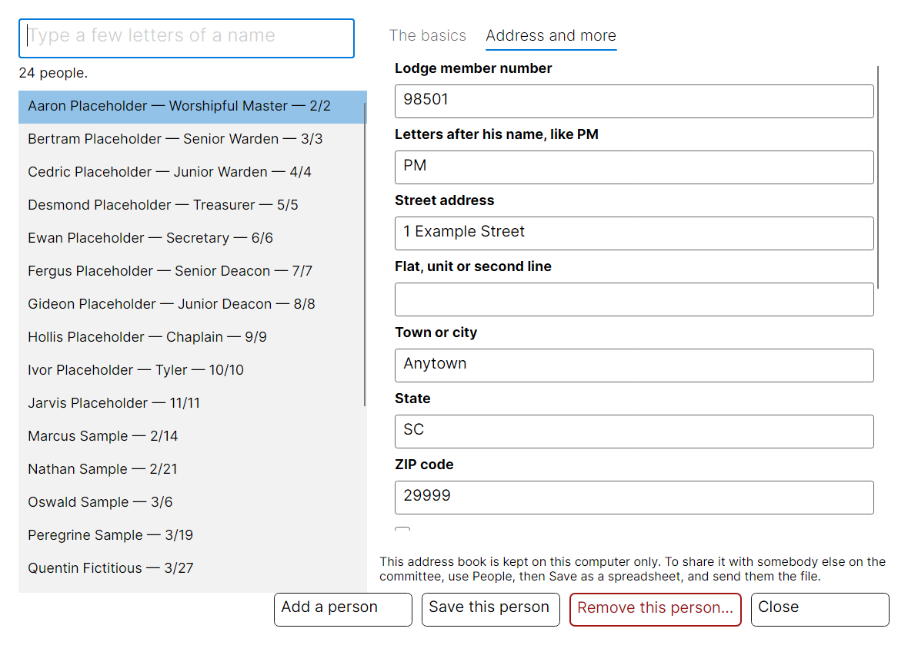
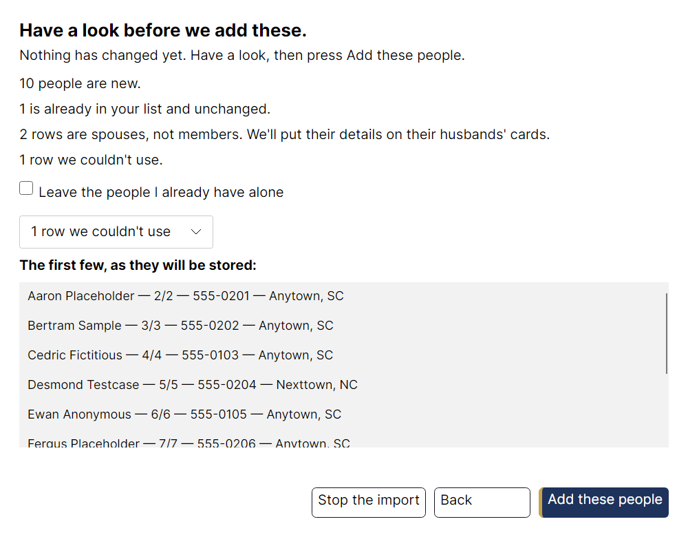
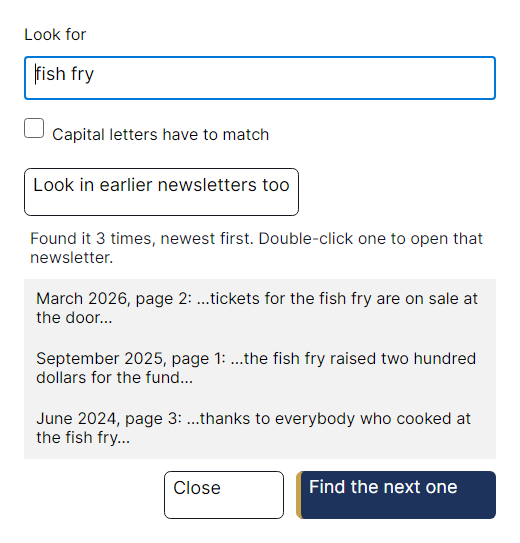
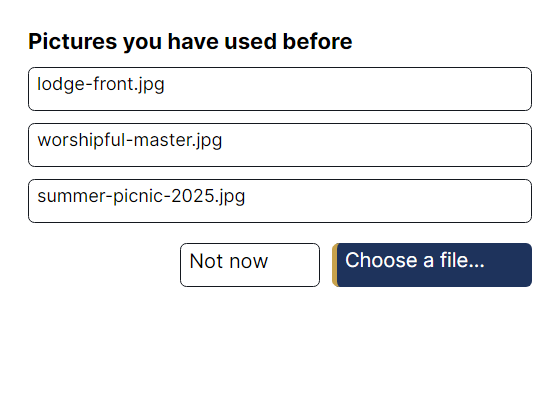
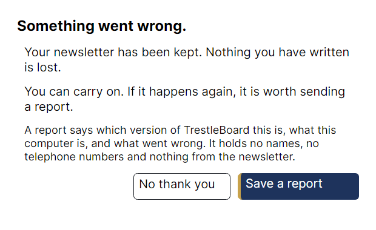

# Images in the documentation

Every image in this folder is generated by `tools/TrestleBoard.Screenshots`
against the fictional sample issue and fictional roster fixtures, in a
temporary app-state root. The harness cannot read `%AppData%/TrestleBoard`, so it
cannot load the real address book or a real recovery snapshot (PLAN.md §0 rule 6).

Regenerate all of them:

```
dotnet run --project tools/TrestleBoard.Screenshots
```

or just the ones that moved, which is the usual case — PNGs do not delta, so every
regeneration adds a full copy to the repository's history:

```
dotnet run --project tools/TrestleBoard.Screenshots -- --only font-picker
```

Last regenerated: **2026-09-04**, TrestleBoard **0.1.0**.
That date covers the run that last touched this file; a `--only` run rewrites it
while leaving the other images as they were, which is the honest reading of it.

## The images

### `hero-issue-page1.png`

The cover of the example newsletter, open in the editor. (the whole editor window, 1280×860, Light, 100% scale)

`dotnet run --project tools/TrestleBoard.Screenshots -- --only hero-issue-page1`


### `text-wrap-around-photo.png`

Body text flowing around a photograph, at actual size. (the whole editor window, 1280×860, Light, 100% scale)

`dotnet run --project tools/TrestleBoard.Screenshots -- --only text-wrap-around-photo`


### `action-panel-photo.png`

Choose a photograph and the things you can do to it appear beside it. (the whole editor window, 1280×860, Light, 100% scale)

`dotnet run --project tools/TrestleBoard.Screenshots -- --only action-panel-photo`


### `action-panel-whats-next.png`

With nothing selected, the panel says what this issue still needs. (the whole editor window, 1280×860, Light, 100% scale)

`dotnet run --project tools/TrestleBoard.Screenshots -- --only action-panel-whats-next`


### `officers-table-widget.png`

The officers table is a list TrestleBoard lays out for you. (the whole editor window, 1280×860, Light, 100% scale)

`dotnet run --project tools/TrestleBoard.Screenshots -- --only officers-table-widget`


### `font-picker.png`

Choosing a typeface, with the newsletter's own words in the preview. (one dialog on its own)

`dotnet run --project tools/TrestleBoard.Screenshots -- --only font-picker`


### `high-contrast.png`

The same page in the high-contrast theme. (the whole editor window, 1280×860, Light, 100% scale)

`dotnet run --project tools/TrestleBoard.Screenshots -- --only high-contrast`


### `scale-200.png`

The same window with everything set to twice the size. (the whole editor window, 1280×860, Light, 100% scale)

`dotnet run --project tools/TrestleBoard.Screenshots -- --only scale-200`


### `how-do-i.png`

Ask in your own words; the answers come from the app itself. (one dialog on its own)

`dotnet run --project tools/TrestleBoard.Screenshots -- --only how-do-i`



### `first-run-tour.png`

Five screens on how a month goes, shown once. (one dialog on its own)

`dotnet run --project tools/TrestleBoard.Screenshots -- --only first-run-tour`



### `pdf-page-picker.png`

The pages of a PDF, as pictures of themselves. (one dialog on its own)

`dotnet run --project tools/TrestleBoard.Screenshots -- --only pdf-page-picker`



### `emblem-shelf.png`

Nineteen emblems, bundled and drawn by the app itself. (one dialog on its own)

`dotnet run --project tools/TrestleBoard.Screenshots -- --only emblem-shelf`



### `bring-in-a-pack.png`

What is in a predecessor's pack, and what taking it would replace. (one dialog on its own)

`dotnet run --project tools/TrestleBoard.Screenshots -- --only bring-in-a-pack`


### `start-screen.png`

The three ways to begin a month's newsletter. (one dialog on its own)

`dotnet run --project tools/TrestleBoard.Screenshots -- --only start-screen`


### `wizard-officers-step.png`

One question per screen, in large type. (one dialog on its own)

`dotnet run --project tools/TrestleBoard.Screenshots -- --only wizard-officers-step`


### `wizard-review.png`

Every wizard ends by showing you what it is about to write. (one dialog on its own)

`dotnet run --project tools/TrestleBoard.Screenshots -- --only wizard-review`


### `officers-sync.png`

The address book fills the officers table in — after showing you every change. (one dialog on its own)

`dotnet run --project tools/TrestleBoard.Screenshots -- --only officers-sync`


### `grid-editor.png`

Or edit the whole list at once, in big rows. (one dialog on its own)

`dotnet run --project tools/TrestleBoard.Screenshots -- --only grid-editor`


### `fix-photo.png`

Behind the one-click Fix photo button: large sliders that apply as you drag. (one dialog on its own)

`dotnet run --project tools/TrestleBoard.Screenshots -- --only fix-photo`


### `position-photo.png`

Recentre the crop without resizing it — the whole picture is visible behind the frame. (one dialog on its own)

`dotnet run --project tools/TrestleBoard.Screenshots -- --only position-photo`


### `photo-template-placeholders.png`

A photo page waiting for its photograph, and saying so. (the whole editor window, 1280×860, Light, 100% scale)

`dotnet run --project tools/TrestleBoard.Screenshots -- --only photo-template-placeholders`


### `settings.png`

Theme, text size, and who to speak to about sickness and distress. (one dialog on its own)

`dotnet run --project tools/TrestleBoard.Screenshots -- --only settings`


### `restore-dialog.png`

After a crash, the work is offered back with a picture of it. (one dialog on its own)

`dotnet run --project tools/TrestleBoard.Screenshots -- --only restore-dialog`


### `people-window.png`

The address book: type three letters and there they are. (one dialog on its own)

`dotnet run --project tools/TrestleBoard.Screenshots -- --only people-window`


### `people-search.png`

Look somebody up by whatever you happen to have. (one dialog on its own)

`dotnet run --project tools/TrestleBoard.Screenshots -- --only people-search`



### `people-address.png`

Everything the lodge already knows about a brother, in one place. (one dialog on its own)

`dotnet run --project tools/TrestleBoard.Screenshots -- --only people-address`



### `import-columns.png`

Importing asks one question per lodge field, not one per column. (one dialog on its own)

`dotnet run --project tools/TrestleBoard.Screenshots -- --only import-columns`


### `import-review.png`

Nothing is written until this screen says what it is about to do. (one dialog on its own)

`dotnet run --project tools/TrestleBoard.Screenshots -- --only import-review`



### `notice-border-and-rule.png`

A shaded notice with a border, and a line right across the page. (the whole editor window, 1280×860, Light, 100% scale)

`dotnet run --project tools/TrestleBoard.Screenshots -- --only notice-border-and-rule`


### `page-footer.png`

Every page says which lodge, which issue, and which page it is. (drawn by the rendering engine — no Avalonia involved)

`dotnet run --project tools/TrestleBoard.Screenshots -- --only page-footer`


### `month-calendar.png`

The month on a grid, with the stated meeting already marked. (drawn by the rendering engine — no Avalonia involved)

`dotnet run --project tools/TrestleBoard.Screenshots -- --only month-calendar`


### `two-columns.png`

An article running down two columns, still breaking around the photograph. (drawn by the rendering engine — no Avalonia involved)

`dotnet run --project tools/TrestleBoard.Screenshots -- --only two-columns`


### `archive-search.png`

Looking for words across every newsletter the committee has kept. (one dialog on its own)

`dotnet run --project tools/TrestleBoard.Screenshots -- --only archive-search`



### `recent-pictures.png`

The pictures used before, offered ahead of the file picker. (one dialog on its own)

`dotnet run --project tools/TrestleBoard.Screenshots -- --only recent-pictures`



### `something-went-wrong.png`

When something goes wrong, the work is already kept. (one dialog on its own)

`dotnet run --project tools/TrestleBoard.Screenshots -- --only something-went-wrong`



### `pdf-page-spread.png`

Three pages of the exported PDF. (drawn by the rendering engine — no Avalonia involved)

`dotnet run --project tools/TrestleBoard.Screenshots -- --only pdf-page-spread`


## Reserved, hand-taken, not yet captured

These two are operating-system security dialogs. No harness can render them, and
M10 still carries them as open acceptance items. They must show no personal data
and no path bearing a user name. **Do not add an image link for either until the
file exists** — `DocsTests` fails on a referenced image that is not there.

- `install-smartscreen.png` — Windows SmartScreen's "More info → Run anyway" step, referenced by docs/INSTALL.md. Hand-taken, not yet captured.
- `install-gatekeeper.png` — macOS Gatekeeper's right-click → Open step, referenced by docs/INSTALL.md. Hand-taken, not yet captured.
